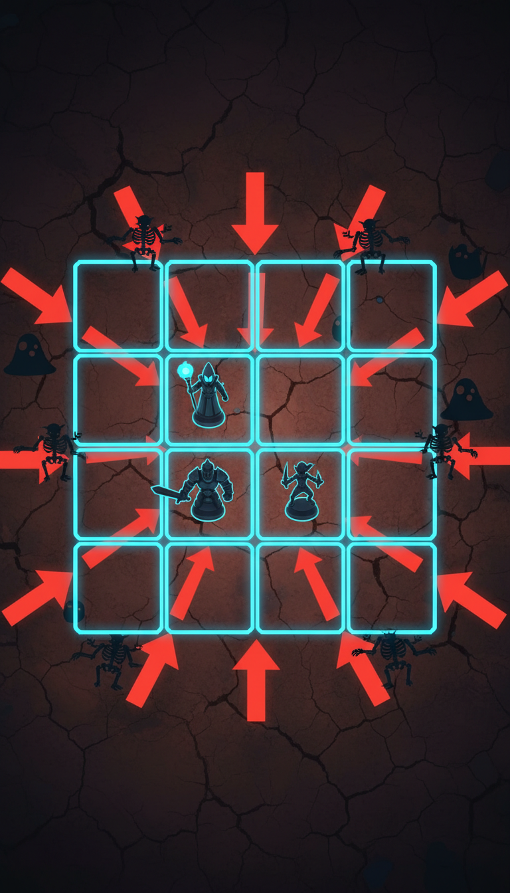

# Function Catalog + Status Reaction Matrix — Design Spec

> **SSOT for forward implementation.** Parent design rationale: [`2026-06-12-fork-a-pivot-addendum.md`](2026-06-12-fork-a-pivot-addendum.md). This doc translates the addendum's pillars into the unambiguous cell-by-cell contract that Phase 4 (vertical slice) and Phase 5 (full rewrite) implement.

**Date:** 2026-06-12 · **Status:** **REVIEW-2** — Wittle-style central-grid revision after first review pass. Awaiting LOCK sign-off.

**Revision history**
- `DRAFT` (`1bf7986`) — initial mirrored-3×3 layout, 8 open questions
- `REVIEW-2` (this rev) — central 4×4 grid w/ 4-edge spawn; WATER → +-cross splash; Vex innate confirmed; boss skip in slice; Modifier-without-Active warps base; wave+forge cadence + hero Ults + FTUE staged unlock added

---

## 1. Cardinal rules (read first)

1. **Every Function is useful in every slot.** No Function is dead weight in Active, Modifier, or Passive — that's the whole point of the Transistor matrix.
2. **Modifier warps the Active beneath it.** If Active is empty, Modifier warps the hero's **base weapon** (never dead).
3. **Passive disables the Function's mechanical attack shapes** and emits a continuous trait/aura instead. Same Function in Passive ≠ same Function in Active.
4. **Statuses live on tiles, not enemies.** When an enemy advances onto a tile carrying a status, it inherits the status. When an enemy dies/leaves, status remains on tile for its duration.
5. **Reactions fire when an incoming damage tag hits an existing status on the target tile.** Damage tag comes from the Active socket of the firing hero (or base weapon if Active empty). Modifier can add a secondary tag. Passive carries no damage tag.
6. **One reaction per hit.** If multiple statuses match, resolve by priority: `Wet > Burning > Chilled > Cracked > Shocked`; tied — oldest stack first.
7. **Reactions consume their input status unless the matrix says otherwise.** Default-cleanse simplifies chaining.
8. **All targeting is Manhattan-distance based from hero tile.** No "row/column" concept — heroes face all 4 directions, enemies spawn from all 4 edges, distance is `|dx| + |dy|`.

---

## 2. The 12 Functions

Three categories. Each id is the in-code constant and visual label.

| Category | Functions |
|---|---|
| **Elements (status emitters)** | `FIRE`, `ICE`, `LIGHTNING`, `WATER`, `EARTH` |
| **Patterns (attack shape)** | `AOE`, `BEAM`, `BOUNCE`, `BURST` |
| **Tactical (targeting + trait)** | `SEEKER`, `LEECH`, `KNOCKBACK` |

Elements emit a status when in Active. Patterns + Tactical do not emit unless they carry an Element via Modifier.

### Slot stacking — resolution order per attack tick

1. **Active socket** defines projectile/shape + the damage tag.
2. **Modifier socket** warps Active's pattern (shape/fan/bounce/etc.) and may add a secondary damage tag.
3. **Passive socket** runs every tick independently — never fires the attack; modifies hero stats, applies auras, grants traits.

If Active is empty, hero attacks with **base weapon** (§6); Modifier still warps it; Passive still runs.

---

## 3. The 36-cell Function × Slot matrix

**Damage tag** = element key emitted when this Function is in Active and a hit lands.
**Modifier warp** = what this Function does to *another* Active beneath it.
**Passive trait** = continuous effect, no attack fired.

All targeting in this section assumes **Manhattan-closest enemy** from hero's tile unless stated otherwise.

### 3.1 Elements

#### `FIRE`
- **Active:** melee single-target, range 1 (any Manhattan-adjacent enemy tile); damage tag = `FIRE`; applies `Burning` to hit tile.
- **Modifier:** adds `FIRE` damage tag to Active's hits (multi-tag attack — reactions resolve on highest-multiplier tag). +20% base dmg. Active's shape unchanged.
- **Passive:** "Forge Aura" — all allied heroes' attacks gain +10% dmg vs `Burning` and `Chilled` targets (exploiter aura).

#### `ICE`
- **Active:** ranged single-target, no range cap; damage tag = `ICE`; applies `Chilled` to hit tile.
- **Modifier:** adds `ICE` damage tag. +15% base dmg. Active's hits slow target's next advance by 1 cadence tick.
- **Passive:** "Frost Field" — enemy advance cadence increases by +1 tick globally (all enemies advance slower while this hero is alive).

#### `LIGHTNING`
- **Active:** chain — primary hit on closest enemy; arcs to 1 next-nearest enemy tile at 50% dmg; damage tag = `LIGHTNING`; applies `Shocked` to both hit tiles.
- **Modifier:** adds `LIGHTNING` damage tag. +25% base dmg, BUT Active gains 20% miss chance on primary hit (chaos modifier).
- **Passive:** "Static Charge" — every 5 ticks, the hero discharges 1 dmg to all enemies in a 4-tile Manhattan-3 radius around itself; applies `Shocked` (no reaction unless an Active hit follows).

#### `WATER`
- **Active:** +-cross splash — target = closest enemy; hits target tile + 4 Manhattan-adjacent tiles (5-tile + pattern); damage tag = `WATER`; applies `Wet` to all hit tiles; base dmg low (0.5× per tile).
- **Modifier:** adds `WATER` damage tag. Active's hits also apply `Wet` to the hit tile (in addition to Active's own status). Damage unchanged.
- **Passive:** "Tidepool" — every 4 ticks, applies `Wet` to a random outer-ring enemy tile (front of advance). Pure utility — sets up reactions.

#### `EARTH`
- **Active:** melee single-target, range 1; damage tag = `EARTH`; applies `Cracked` (stacks up to 3) to hit tile; high base dmg (1.5×), slow attack speed (1 atk per 2 ticks).
- **Modifier:** adds `EARTH` damage tag. Active's hits also stack `Cracked` (+1 per hit). +30% base dmg, -20% attack speed.
- **Passive:** "Tectonic Plate" — hero gains +30% HP and +10% dmg reduction.

### 3.2 Patterns

#### `AOE`
- **Active:** radial blast on target = closest enemy; hits target + 4 Manhattan-adjacent tiles (5-tile + shape); damage tag = none; base dmg 0.7× per tile hit.
- **Modifier:** Active's shape becomes radial — Active strikes target tile + all 4 Manhattan-adjacent. Per-tile dmg = Active base × 0.7. Status emission from Active spreads to all hit tiles.
- **Passive:** "Concussion Aura" — once per 6 ticks, emits a silent blast on 4 Manhattan-adjacent tiles to hero: 1 dmg + minor advance reset on hit enemies. No status.

#### `BEAM`
- **Active:** straight-line piercing in the cardinal direction of the closest enemy (N/S/E/W from hero); hits every enemy tile on that line through grid edge; damage tag = none; base dmg 0.6× per tile, 1 atk per 2 ticks.
- **Modifier:** Active's projectile becomes piercing — continues through first target in a 4-cardinal line, hits every enemy tile behind it. Per-tile dmg falls 20% per pierce. Status emission applies to every pierced tile.
- **Passive:** "Long Sight" — enemy HP visible across grid; +15% dmg vs enemies on outer ring (any tile with `|col-1.5| + |row-1.5| ≥ 2.5`, i.e., corner + edge tiles).

#### `BOUNCE`
- **Active:** ricochet — primary hit on closest enemy, then bounces to next-closest enemy tile by Manhattan from impact, up to 3 hits total; damage tag = none; base dmg 0.8× per hit, no falloff.
- **Modifier:** Active's projectile gains 2 bounces after impact — each bounce hits next-closest by Manhattan from prior impact at 70% prior dmg. Status emission applies per bounce.
- **Passive:** "Echo" — 20% chance per hero attack to trigger a free secondary hit on same target tile (same Active behavior, half dmg). Triggers off any attack the hero fires.

#### `BURST`
- **Active:** 3-shot fan — fires at closest enemy + 2 next-nearest enemy tiles in a fan; damage tag = none; base dmg 0.45× per shot (3 × 0.45 = 1.35× total).
- **Modifier:** Active fires 3 shots in a fan instead of 1 — primary target + 2 next-nearest. Per-shot dmg = Active × 0.45. Status emission applies per shot — 3 separate reaction opportunities.
- **Passive:** "Rapid Fire" — hero attack speed +40% (1 atk per 0.6 ticks). Affects whatever Active is socketed (or base weapon).

### 3.3 Tactical

#### `SEEKER`
- **Active:** auto-targets lowest-current-HP enemy on grid regardless of position; ranged single-target, damage tag = none; base dmg 0.9×; ignores cover/positioning.
- **Modifier:** overrides Active's targeting — Active now strikes lowest-HP enemy instead of closest. Shape + damage tag of Active preserved.
- **Passive:** "Executioner" — hero attacks deal +50% dmg to enemies under 30% HP. Late-fight scaling.

#### `LEECH`
- **Active:** melee single-target, range 1; damage tag = none; base dmg 0.6×; heals self for 50% of dmg dealt.
- **Modifier:** Active's hits heal the firing hero for 25% of dmg dealt. Shape + dmg tag + status preserved.
- **Passive:** "Lifelink" — hero passively heals 1 HP per tick (every tick, regardless of attack). Also DISABLES mechanical attacks (Modifier + Active) — when LEECH is in Passive, this hero does not fire, only sustains.

#### `KNOCKBACK`
- **Active:** melee single-target, range 1; damage tag = none; base dmg 0.5×; pushes target back 1 tile away from hero (toward spawn edge).
- **Modifier:** Active's hits push target 1 tile away from hero on connect. Stacks with Active's status emission (push happens after damage, so reaction still resolves on pre-push tile).
- **Passive:** "Repulse Field" — when any enemy advances onto a tile Manhattan-adjacent to this hero, push them back 1 tile (1× per tick max). Defensive zoning.

---

## 4. Status output table

5 statuses emitted by Element Functions in Active. Patterns + Tactical do not emit unless they carry an Element via Modifier.

| Function (Active) | Status | Duration | Stack rules | Decay / cleanse |
|---|---|---|---|---|
| `FIRE` | **Burning** | 3 ticks | refresh on re-apply (no stack) | natural decay; cleansed by `WATER`-tag reaction |
| `ICE` | **Chilled** | 3 ticks | refresh | cleansed by `FIRE`-tag reaction |
| `LIGHTNING` | **Shocked** | 2 ticks | refresh | natural decay only (short by design) |
| `WATER` | **Wet** | 4 ticks | refresh | cleansed by `FIRE`-tag reaction (Steam) |
| `EARTH` | **Cracked** | 4 ticks | stacks to 3 (+15% incoming dmg per stack) | natural decay; no element cleanse |

**Tile-level passive effect** (active even without a reaction firing):

| Status | Effect on occupying enemy |
|---|---|
| Burning | -2 HP per tick |
| Chilled | next advance takes 2× cadence ticks |
| Shocked | -1 HP per tick + 10% chance to skip own attack |
| Wet | no inherent dmg; reaction-enabler only |
| Cracked | +15% incoming dmg per stack (max +45% at 3) |

---

## 5. The reaction matrix (15 reactions, v1)

| # | Incoming tag | × Status | → Reaction | Dmg mult | Splash | Status mutation | VFX hook |
|---|---|---|---|---|---|---|---|
| 1 | `LIGHTNING` | × Wet | **Electrocute** | 2.0× | 1-tile Manhattan (4 adj) | cleanse Wet on origin + adj; apply Shocked to splashed | `vfx_arc_chain` |
| 2 | `FIRE` | × Wet | **Steam** | 1.0× | 1-tile radius (5-tile +) | cleanse Wet + Burning on origin + adj; apply `Blind` to splashed enemies | `vfx_steam_puff` |
| 3 | `FIRE` | × Chilled | **Thaw** | 1.5× | none | cleanse Chilled; no new status | `vfx_fire_burst` |
| 4 | `FIRE` | × Cracked | **Magma Burst** | 1.8× | 1-tile Manhattan | consume 1 Cracked stack; apply Burning to splashed | `vfx_magma` |
| 5 | `ICE` | × Wet | **Freeze Solid** | 1.5× | none | cleanse Wet; apply `Frozen` (1-tick skip own turn) | `vfx_freeze_solid` |
| 6 | `ICE` | × Burning | **Frostbite** | 1.3× | none | cleanse Burning; apply Chilled | `vfx_frostbite` |
| 7 | `ICE` | × Shocked | **Capacitor** | 1.4× | none | refresh Shocked for 2× duration; cleanse Chilled if any | `vfx_arc_freeze` |
| 8 | `WATER` | × Burning | **Quench** | 0.8× | none | cleanse Burning; apply Wet | `vfx_steam_small` |
| 9 | `WATER` | × Shocked | **Backsplash** | 0.5× | 1-tile Manhattan (only tiles already Wet) | propagate Shocked to splashed Wet tiles | `vfx_water_arc` |
| 10 | `WATER` | × Cracked | **Mudslide (W)** | 1.2× | none | consume 1 Cracked stack; apply slow (+2 ticks to next advance) | `vfx_mudslide` |
| 11 | `EARTH` | × Wet | **Mudslide (E)** | 1.4× | none | cleanse Wet; apply slow (+2 ticks) | `vfx_mudslide` |
| 12 | `EARTH` | × Burning | **Ash Cloud** | 1.2× | 1-tile Manhattan | cleanse Burning on origin; apply `Blind` to splashed | `vfx_ash_cloud` |
| 13 | `EARTH` | × Chilled | **Avalanche** | 1.6× | none | cleanse Chilled; knockback 1 tile away from grid center | `vfx_rock_slam` |
| 14 | `LIGHTNING` | × Cracked | **Stonesmith** | 2.0× | none | consume 1 Cracked stack; apply Shocked | `vfx_arc_stone` |
| 15 | `LIGHTNING` | × Burning | **Arc Storm** | 1.5× | 1-tile Manhattan | spread Shocked to splashed; consume Burning on origin only | `vfx_arc_storm` |

**Not in matrix (base dmg only):** any tag × no status; `WATER` × Wet; `WATER` × Chilled; `FIRE` × Burning; `ICE` × Chilled; `EARTH` × Cracked; `EARTH` × Shocked; `LIGHTNING` × Shocked. Self-stack or pruned for table tractability.

**Auxiliary statuses introduced by reactions only:**

| Status | Effect | Duration |
|---|---|---|
| `Blind` | enemy's next attack misses | 1 attack instance |
| `Frozen` | enemy skips next attack + advance | 1 tick |
| `Bleed` (Vex Ult only — see §12) | enemy loses 5% max HP per tick | 4 ticks |

Cleanse: natural decay only.

---

## 6. Per-hero base weapons (3 heroes — Bran, Elara, Vex)

What each hero does with **ZERO Functions socketed**. Base attack is implicit "Active" if Active socket empty; Modifier still warps it; Passive still runs.

| Hero | Base attack | Damage tag | Status emit | Base dmg | Atk cadence | Crit | HP |
|---|---|---|---|---|---|---|---|
| **Bran (Warrior)** | melee single-target, range 1 (any Manhattan-adj enemy) | none | none | 1.0× | 1 atk/tick | 0% | 100 |
| **Elara (Mage)** | ranged single-target, no range cap (any enemy tile on grid) | none | none | 0.8× | 1 atk/tick | 0% | 70 |
| **Vex (Rogue)** | melee single-target, range 1 | none | none, **but +20% dmg vs `Burning` targets** (innate trait) | 0.9× | 1.2 atk/tick | 15% (2× crit) | 80 |

**Squad role guidance:**
- **Bran** = front-line. Benefits most from `BEAM` / `BURST` Modifier or `LEECH` self-sustain.
- **Elara** = caster + status setter. Benefits most from `LIGHTNING` / `AOE` / `FIRE` / `WATER` Active for reaction setup.
- **Vex** = executor. Pair after Burning is on board. Auto-exploits via innate trait.

---

## 7. Grid scheme — central 4×4, enemies from 4 sides

**16-tile single battlefield** (no mirrored player/enemy grids). Inner 2×2 = hero deploy zone (4 slots, 3 used for trio + 1 reserved for future summon/terrain). Outer 12 tiles = battlefield where enemies advance through.



```
              N spawn edge (4 spawn tiles)
              ↓     ↓     ↓     ↓
           ┌──────┬──────┬──────┬──────┐
           │ (0,0)│ (1,0)│ (2,0)│ (3,0)│  row 0
           ├──────┼──────┼──────┼──────┤
    W →    │ (0,1)│ (1,1)│ (2,1)│ (3,1)│  row 1   ← E
  spawn    │      │  H   │  H   │      │
   tiles   ├──────┼──────┼──────┼──────┤
    W →    │ (0,2)│ (1,2)│ (2,2)│ (3,2)│  row 2   ← E
  (0,1)    │      │  H   │  H   │      │
  (0,2)    ├──────┼──────┼──────┼──────┤
           │ (0,3)│ (1,3)│ (2,3)│ (3,3)│  row 3
           └──────┴──────┴──────┴──────┘
              ↑     ↑     ↑     ↑
              S spawn edge (4 spawn tiles)
```

**Coord convention:** `(col, row)`, both 0-indexed, top-left = `(0,0)`. Total 16 tiles.

**Hero deploy zone (inner 2×2):** `(1,1)`, `(2,1)`, `(1,2)`, `(2,2)`. Heroes are static in v1 — deploy on run start (or scripted unlock for Bran/Vex per FTUE — see §13).

**Spawn edges (outer ring, 12 tiles):**
- **N edge** = row 0, all 4 cols: `(0,0)`, `(1,0)`, `(2,0)`, `(3,0)`
- **S edge** = row 3, all 4 cols: `(0,3)`, `(1,3)`, `(2,3)`, `(3,3)`
- **W edge** = col 0, mid rows: `(0,1)`, `(0,2)` (corners belong to N/S)
- **E edge** = col 3, mid rows: `(3,1)`, `(3,2)`

Total = 12 spawn tiles. Wave directors (Phase 4 throwaway, Phase 5 proper) pick which spawn tiles activate per wave.

**Manhattan distance** (canonical, used by all targeting): `distance(a, b) = |a.col - b.col| + |a.row - b.row|`. Exported by `grid_state.gd`.

**Grid center** = midpoint between `(1,1)`, `(2,1)`, `(1,2)`, `(2,2)`. For "advance toward center" math, an enemy at `(c, r)` moves toward the inner-2×2 tile with lowest Manhattan distance — see §8.2.

**Boss footprint** (Phase 5 only — skipped in vertical slice per §10 Q7): 2×1 or 2×2 footprint on the spawn edge, single HP bar, scripted advance. Out of scope for slice.

---

## 8. Targeting + advance + cadence rules

### 8.1 Targeting (Manhattan-closest from hero tile)

All targeting derives from the **firing hero's tile** + the **Active socket** (or base weapon if empty). Tie-breakers (deterministic, no RNG): lowest col index, then lowest row index.

| Active type | Selection algorithm |
|---|---|
| Melee single (FIRE / EARTH / KNOCKBACK / LEECH / Bran / Vex) | closest enemy by Manhattan, capped at range 1 (must be Manhattan-adj to hero tile). If no enemy in range → no attack this tick. |
| Ranged single (LIGHTNING primary / Elara base) | closest enemy by Manhattan, no range cap |
| Cross splash (WATER) | closest enemy = target tile; hit = target + 4 Manhattan-adj tiles (5-tile +) |
| Radial (AOE Modifier or Active) | closest enemy = anchor; hit = anchor + 4 Manhattan-adj (5-tile +) |
| Pierce (BEAM Active or Modifier) | closest enemy determines cardinal direction (N/S/E/W from hero); fire a line in that cardinal from hero's tile through every enemy tile until grid edge |
| Bounce (BOUNCE Active or Modifier) | primary = closest by Manhattan; next bounces choose next-closest by Manhattan from previous impact, up to 3 hits |
| Multi-shot (BURST Active or Modifier) | primary = closest; +2 next-closest by Manhattan (3-shot fan, 3 separate hits) |
| Seeker (SEEKER Active or Modifier) | lowest current-HP enemy on grid, no range cap |

**ICE** Active is **ranged single** with `ICE` damage tag (not melee — overrides any §3 text suggesting otherwise).

### 8.2 Enemy advance

- **Spawn:** enemy appears on its assigned spawn tile (one of 12 outer-ring tiles).
- **Advance step:** every cadence tick (default = 4 ticks/step), enemy moves 1 tile toward grid center.
  - Step direction = the cardinal that reduces Manhattan distance to **nearest hero tile** most. If multiple equal, prefer cardinal in this priority: ↓ (south), → (east), ↑ (north), ← (west) — deterministic.
  - Edge corners (e.g., spawn `(0,0)` — NW corner) move diagonally if both N→S and W→E reduce distance equally → in 1 cadence step, it moves to either `(1,0)` or `(0,1)` per priority above (south wins → `(0,1)`).
- **Contact with hero:** when an enemy's next advance would land on a hero-occupied tile, it engages instead — enemy stays on its current ring tile, deals **1 dmg/tick** to that hero. Hero auto-attacks resolve normally.
- **Hero death:** if hero dies, the engaging enemy advances onto the now-vacant hero tile, then continues advancing past the inner zone. Enemies that traverse the full inner zone "exit" the grid → squad-wide damage of 2 dmg/tick to all surviving heroes per such enemy until killed (off-grid enemies can still be Seeker-targeted).
- **`Chilled` status:** next advance takes 2× cadence ticks (8 instead of 4).
- **`Frozen` status:** skip next advance entirely (1 tick).
- **Knockback (Avalanche / KNOCKBACK Active):** push enemy 1 tile *away from grid center* (toward its origin spawn edge). If at edge already, no effect.

### 8.3 Tick cadence

- 1 tick = 0.5 game-sec at 1× speed. Player may toggle 2× speed in HUD. All tunable in `combat.gd` consts.
- Per tick, in order:
  1. **Status decay pass** — decrement duration of every active status on every tile/enemy.
  2. **Enemy advance pass** — decrement advance counters; resolve advance steps; resolve knockback/freeze interactions.
  3. **Hero attack pass** — in deploy order (Bran → Elara → Vex or whoever's live), call `resolve_active(hero) → AttackResult` per hero with ≥1 atk-per-tick or accumulated speed budget.
  4. **Reaction resolve pass** — every hit emitted by step 3 checked against `tile_status[target]` by `element_mediator.gd`; dispatches reactions per §5 matrix.
  5. **Death + cleanup pass** — remove dead enemies, leave status on tile until natural decay.
- A wave ends when all spawned enemies for that wave are dead. Player tile cross-over does NOT immediately lose the wave — only squad HP attrition does.

---

## 9. Wave / Shop / Pacing — the run loop

Game is wave-based with discrete forge breaks. Not pure-continuous Wittle. Mapping closer to Brotato + TFT than the addendum's reference set.

### 9.1 Per-run loop

| Phase | Duration | Time scale | What happens |
|---|---|---|---|
| **Deploy** (run start, once) | ~15 sec | paused | shop rolls 5 Functions. Player drags into 9 sockets (3 heroes × 3 slots; locked heroes invisible during FTUE — see §13). Tap **Ready** → wave 1 starts. |
| **Wave** (combat) | ~10–15 sec | real-time | enemies spawn at assigned edges + advance inward. Heroes auto-fire per Active. Reactions resolve. Player watches + taps **Ultimate** when charged. |
| **Forge break** | ~6–8 sec | paused | wave clears → shop re-rolls 5 new Functions. Auto-merge L1→L5 runs automatically. Player drags new Functions into sockets (replace = discard old for gold). Tap **Continue** → next wave. |
| **Boss wave** (every 5 waves, Phase 5+) | ~30 sec | real-time | bigger enemy, scripted phases, longer forge break after. Skipped in vertical slice. |
| **Run end** | — | — | after wave 10–12 victory, or full squad death = defeat. Meta-XP awarded. |

### 9.2 Stack assembly speed

- **Deploy** = 15 sec / 9 sockets = ~1.6 sec per socket. Tight but workable since Functions are color-coded (Element red/blue/yellow/cyan/brown, Pattern purple, Tactical green) and snap-to-socket has magnetic UX.
- **Forge break** = 6–8 sec / 3–5 swaps = ~1.5 sec per swap.
- **Speed aids (Phase 5 polish — Phase 4 stubs only):**
  - **Lock pin** per shop slot — that slot does not re-roll next break.
  - **Category filter chip** — Elements / Patterns / Tactical tabs filter shop view.
  - **Auto-merge** — duplicate Function drops on existing socket auto-merges L1+L1→L2 with no extra tap.
  - **Magnetic snap zones** with haptic feedback (mobile).

### 9.3 Shop rules

- 5 slots, each carrying 1 Function card.
- Cost per Function = scaling with wave (W1 = 1 gold, W3 = 2 gold, W6 = 3 gold, etc.).
- Re-roll cost = 1 gold (Phase 5 polish).
- Gold earned per kill = 1 (Phase 5 tunes).
- **No mid-wave shop access.** Shop opens only on forge break + deploy. Keeps wave focus.

---

## 10. Hero Ultimates — the juicy combo moments

Each hero has **1 hero-locked Ultimate**, not a Function. Charge resource = squad-shared **Reaction Charge** bar.

**Charge rule:** every 3 reactions triggered by any hero (any reaction in §5) → +1 Ult bar. Max 3 bars stored. Bars persist across waves until used.

**Tap hero portrait** (HUD) when ≥1 bar → fires that hero's Ult, consumes 1 bar.

### 10.1 Bran — "Leap & Slam" (the requested kinetic moment)
- 1-tick wind-up: Bran sprite arcs upward off the grid (visible airborne).
- Crashes onto the enemy tile furthest from grid center (back-row enemy by Manhattan from `(1.5, 1.5)`); explodes for **5× base dmg** in a 5-tile + radial pattern (target + 4 Manhattan-adj).
- Applies `Cracked` (+2 stacks) to all hit tiles.
- Returns to home tile in 1 tick (animation only, invulnerable during 2-tick total).
- Best paired with EARTH or LIGHTNING Active for Magma Burst / Stonesmith chains on return swing.

### 10.2 Elara — "Chain Storm"
- Spawns 8 LIGHTNING arc-jumps that chain across every grid tile carrying `Wet` status.
- Each jump = 2× base dmg + applies `Shocked` to hit tile.
- If no Wet tiles → degrades to "all enemies on grid take 1× LIGHTNING dmg" (failsafe — never dead Ult).
- Hard reward for setup: pre-Wet the grid via WATER Active → Elara Ult = grid-clear.

### 10.3 Vex — "Phantom Strike"
- Teleports adjacent to lowest-HP enemy regardless of position (cosmetic — Vex's "home" deploy slot returned to after).
- 3 strikes at 200% each, crit-locked (always crit).
- Applies `Burning` + `Bleed` to target tile. `Bleed` = 4 ticks at 5% max-HP/tick (Vex-Ult-only, not in standard matrix).
- Cleanup ability — drops 1–3 enemies per use.

**VFX hooks (Phase 4 stubs as colored flashes; Phase 5 art-pass):** `vfx_bran_leap`, `vfx_elara_storm`, `vfx_vex_phantom`.

---

## 11. Forge UI implications (Phase 4 / 5)

Design contract for UI rewrite (not implementation).

- **Shop card** shows: Function id, category color (see §9.2), and a 3-row preview of Active/Modifier/Passive behavior summaries (4–6 words each — pull from §3).
- **Hero forge panel** shows: 3 stacked sockets (Active top, Modifier middle, Passive bottom), each labeled. Empty Active reads "Base weapon". Dragging a card into a socket previews the combined effect (e.g., "Base + ICE Mod = ranged + chill on hit").
- **Hud during wave:** 3 hero portraits with Ult bar fill, squad HP indicator, wave counter, reaction-chain counter (for charge feedback).
- **No recipes.** Merge (L1→L5 auto-merge) survives at slot level — drop a 2nd `FIRE` on a 1-star `FIRE` Function = 2-star (1.5× values), behavior identical per slot. Details defer to existing `merge.gd` with Function-card data shape.

---

## 12. FTUE — staged hero unlock (replays on debug reset)

Goal: ease player into the forge → status → reaction → Magicka-chain progression by introducing heroes one at a time across the first 6 waves.

**Replay condition:** FTUE plays on first run AND replays whenever `AccountState.reset()` clears the `ftue_complete` flag (debug reset button on Home already does this — no new code path needed). Useful for demos / showcase to multiple people.

**Wave-by-wave FTUE script:**

| Wave | Heroes live | Shop | Enemy spawn | Tutorial overlay |
|---|---|---|---|---|
| **1** | Elara solo at `(1,2)` | forced cards: `FIRE` + `WATER` only | 3 weak goblins, N edge only | "Drag FIRE to Elara's Active. Watch FIRE projectiles + Burning status." |
| **2** | Elara solo | normal 5-roll | 4 enemies, N + S edges | "Try a Modifier — warps the Active beneath. Try WATER as Mod for a Wet+FIRE multi-hit." |
| **3** | + **Bran joins** at `(2,2)` (cinematic via `PullOverlay`) | normal 5-roll | 5 enemies, N + S + W edges | "Elara WATER on a tile + Bran swing with FIRE Mod = **STEAM** reaction. First Magicka moment." |
| **4** | Elara + Bran | normal | 5 enemies, 3 edges | hint: "Stack reactions to fill Ult bar (top-left)." |
| **5** | Elara + Bran | normal | 6 enemies, 3 edges | hint: "Tap Bran portrait when Ult bar full = **Leap & Slam**." |
| **6** | + **Vex joins** at `(2,1)` (cinematic via `PullOverlay`) | normal | 7 enemies, all 4 edges | "Vex executes Burning targets. Chain reactions across all 3 heroes = full Magicka loop." |
| **7–10** | full squad | normal | scaling, all 4 edges | no overlays. Open play. |

**Mechanics during FTUE:**
- Locked heroes are not shown in HUD or forge panel (gradual reveal).
- Forced shop cards (W1) ensure first reaction is reachable.
- Cinematic at Bran/Vex unlock = reuse `pull_overlay.gd` from 2_WC P0 — show character portrait + flavor line ("Bran joins the forge.").
- Once `ftue_complete = true`, subsequent runs deploy all 3 heroes from W1 with normal shop rolls.

**Implementation notes (Phase 5 — Phase 4 stubs only):**
- `AccountState` gains `ftue_complete: bool` (default false). Set true on victory of wave 10 of first run. Cleared by `reset()`.
- `WaveDirector` (new, Phase 5) reads `ftue_complete` + current wave to drive scripted vs open play.
- Reuse `pull_overlay.gd` for cinematic unlock (already proven in P0).

---

## 13. Locked decisions (REVIEW-2 sign-off pending)

| # | Decision | Status |
|---|---|---|
| 1 | 12-Function set: FIRE/ICE/LIGHTNING/WATER/EARTH + AOE/BEAM/BOUNCE/BURST + SEEKER/LEECH/KNOCKBACK | ✅ LOCKED |
| 2 | 15-reaction matrix (Electrocute, Steam, Thaw, Magma Burst, Freeze Solid, Frostbite, Capacitor, Quench, Backsplash, Mudslide-W, Mudslide-E, Ash Cloud, Avalanche, Stonesmith, Arc Storm) | ✅ LOCKED |
| 3 | Status durations: Burning 3 / Chilled 3 / Shocked 2 / Wet 4 / Cracked 4 ticks | ✅ LOCKED |
| 4 | Central 4×4 grid, enemies from 4 sides, heroes static in inner 2×2 | ✅ LOCKED |
| 5 | WATER Active = +-cross 5-tile splash (replaces cone) | ✅ LOCKED |
| 6 | Vex innate Burning exploiter (+20% dmg vs Burning), hard-coded hero trait | ✅ LOCKED |
| 7 | Boss skipped in vertical slice; reintroduced in Phase 5 | ✅ LOCKED |
| 8 | Modifier without Active warps base weapon (never dead) | ✅ LOCKED |
| 9 | FTUE staged unlock (Elara W1-2 → +Bran W3 → +Vex W6); replays on `AccountState.reset()` (debug menu) | ✅ LOCKED |
| 10 | Wave + forge break cadence (10–15s wave / 6–8s break, ~10–12 waves per run) | ✅ LOCKED |
| 11 | Hero Ults: Leap & Slam (Bran) / Chain Storm (Elara) / Phantom Strike (Vex), 3-reaction charge | ✅ LOCKED |

**LOCK gate:** user reads this revision end-to-end + signs off → status flips to `LOCKED`, Phase 4 vertical slice branch cuts. Below this line, no design churn — implementation only.

---

## Appendix A — Implementation hooks (Phase 4 dev reference)

- `function_data.gd` (Resource): `id: String`, `category: enum`, `active_behavior: Dict`, `modifier_behavior: Dict`, `passive_behavior: Dict`, `damage_tag: StringName` (empty for non-elements), `status_emit: StringName` (empty for non-emitters), `base_dmg_mult: float`, `atk_speed_mod: float`.
- `status_data.gd` (Resource): `id`, `duration`, `stack_max`, `tile_effect`, `decay_rule`.
- `reaction_data.gd` (Resource): `incoming_tag`, `existing_status`, `dmg_mult`, `splash_radius`, `splash_filter` (none / Manhattan-1 / Manhattan-1-wet-only / Manhattan-1-Cross-5), `status_mutation` (Dict of cleanse/apply ops), `vfx_hook`.
- `grid_state.gd` (autoload): `tile_status: Dict[Vector2i, Array[StatusInstance]]`, `enemy_occupants: Dict[Vector2i, Enemy]`, `hero_occupants: Dict[Vector2i, Hero]`. Exports `distance(a: Vector2i, b: Vector2i) -> int` (Manhattan).
- `element_mediator.gd` (autoload): subscribes to `hit_landed(attacker, target_tile, damage, tags)` signal; checks `tile_status[target_tile]` vs `tags`; dispatches reaction from `reaction_data.gd` registry; emits `reaction_triggered` signal back to combat for VFX + dmg apply. Increments squad-shared `reaction_count` counter; emits `ult_charged` signal when count crosses every 3rd increment.
- `combat_v2.gd` (vertical slice; graduates to `combat.gd` Phase 5): tick loop driving §8.3 pass order; per-hero attack pass calls `resolve_active(hero) → AttackResult`; result feeds `element_mediator`.
- `wave_director.gd` (Phase 5; Phase 4 hardcodes 5 waves): reads `ftue_complete` + wave index → spawns scripted vs open-play enemies + edges.
- `ult_controller.gd` (Phase 5; Phase 4 stubs with colored flash): handles Ult charge accumulation, portrait-tap input, hero-specific Ult routines (Leap/Storm/Phantom).
- Reuse from 2_WC P0: `pull_overlay.gd` for FTUE cinematics (Bran/Vex unlock); `account_state.gd` extended with `ftue_complete` bool; `hero_progress.gd` unchanged (still drives between-run meta-XP).
