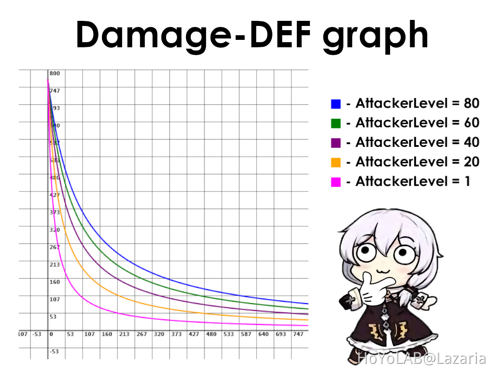

# A detailed look at the damage calculation in Honkai Impact 3rd

**Author:** Lazaria (uid 100325697)
**Post date:** 2021-12-06 05:46:50 UTC
**Source:** https://www.hoyolab.com/article/1564676
**Game:** Honkai Impact 3rd

---

Few months ago I was looking for DEF formula and was surprised when there was none that actually works, so I went to investigate it myself. Soon I decided to write a paper about it to close this subject once and for all. That led to the necessity of proving how the calculation of damage works in general and thus this project was born.

During my investigation I also found how exactly Counter weather in abyss works, how affixes that increase elemental/physical damage work, why you should use Edison instead of Rasрutin/Shakespeare on your HB, can enemies have negative resistance and a bunch of other interesting facts.

You can check the paper [here](https://docs.google.com/document/d/1A6Froe6dWII5URDxfE_g7Jo42pCtFf8iLS6-vTgqvFI/view), any feedback is much appreciated!

[Here](https://i.imgur.com/X8E9zfR.png) is a single-image damage formula for easier sharing, but it lacks a lot of details mentioned in the research.
